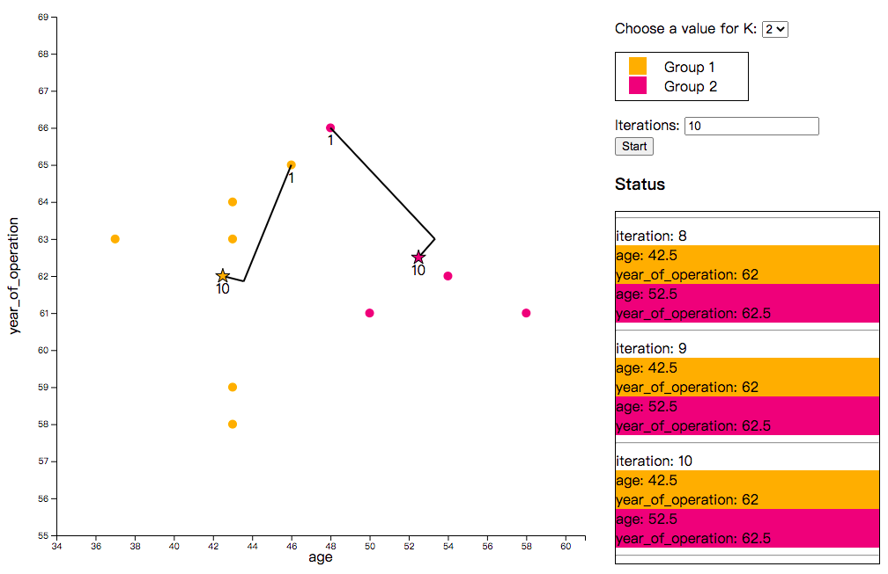
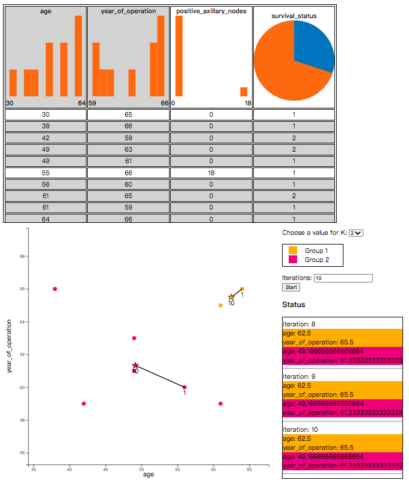

# kmeans-js
* Clickable/Interactive [kmeans algorithm](https://en.wikipedia.org/wiki/K-means_clustering) in javascript 
* It can be integrated into a web application
* It is based on [d3](https://d3js.org/)

# Setup

Include the libraries

```html
<script src="https://d3js.org/d3.v4.min.js"></script>
<script src="../dist/kmeansjs.min.js"></script>
<link rel="stylesheet" href="../dist/kmeansjs.min.css" />
```

## CDN - UNPKG
```html
<script src="https://unpkg.com/@ywlee/k-means-js@1.0.0/dist/kmeansjs.min.js"></script>
<link rel="stylesheet" href="https://unpkg.com/@ywlee/k-means-js@1.0.0/dist/kmeansjs.min.css" /> 
```

# Usage
## Hello World example
Create an element to hold the table

```html
<div id="mykmeans"></div>
```

Turn the div element into a d3 scatter chart with some simple javascript

```javascript
var mykmeans = kmeansjs.kmeans();
mykmeans.init(document.getElementById("mykmeans"), {
    selectedDataSet: [
    {age: 37, year_of_operation: 63, positive_axillary_nodes: 0, survival_status: 1},
    {age: 43, year_of_operation: 58, positive_axillary_nodes: 52, survival_status: 2},
    {age: 43, year_of_operation: 59, positive_axillary_nodes: 2, survival_status: 2},
    {age: 43, year_of_operation: 63, positive_axillary_nodes: 14, survival_status: 1},
    {age: 43, year_of_operation: 64, positive_axillary_nodes: 2, survival_status: 1},
    {age: 46, year_of_operation: 65, positive_axillary_nodes: 20, survival_status: 2},
    {age: 48, year_of_operation: 66, positive_axillary_nodes: 0, survival_status: 1},
    {age: 50, year_of_operation: 61, positive_axillary_nodes: 0, survival_status: 1},
    {age: 54, year_of_operation: 62, positive_axillary_nodes: 0, survival_status: 1},
    {age: 58, year_of_operation: 61, positive_axillary_nodes: 2, survival_status: 1}
    ], 
    selectedColumns: ["age", "year_of_operation"]
});
```



Take a look at [examples/hello.html](https://github.com/study-ml/kmeans-js/blob/main/examples/hello.html) for more information

## Work with the [chart table](https://github.com/study-ml/chart-table)

Include the libraries

```html
<script src="https://d3js.org/d3.v4.min.js"></script>
<script src="../dist/kmeansjs.min.js"></script>
<script src="../dist/charttable.min.js"></script>
<link rel="stylesheet" href="../dist/kmeansjs.min.css"></link>
<link rel="stylesheet" href="../dist/charttable.min.css"></link>
```

Create div elements to hold the table

```html
<div id="mytable"></div>
<div id="mykmeans"></div>
```

Work with [chart table](https://github.com/study-ml/chart-table)

```javascript
const mytable = charttable.table();
const mykmeans = kmeansjs.kmeans();
const tol_vibrant = ["#EE7733", "#0077BB", "#33BBEE", "#EE3377", "#CC3311", "#009988"];
mytable.initTbl(document.getElementById("mytable"), {
    colors: tol_vibrant,
    minSelectedRow2Show: 4,
    minSelectedCol2Show: 2,
    height: 540,
    onSelect: function(data) {
    mykmeans.init(document.getElementById("mykmeans"), {
        selectedDataSet: data.selectedRows, 
        selectedColumns: data.selectedColumns
    });
    }
});

mytable.showDataset([
    {age: 30, year_of_operation: 65, positive_axillary_nodes: 0, survival_status: 1},
    {age: 38, year_of_operation: 66, positive_axillary_nodes: 0, survival_status: 1},
    {age: 42, year_of_operation: 59, positive_axillary_nodes: 0, survival_status: 2},
    {age: 49, year_of_operation: 63, positive_axillary_nodes: 0, survival_status: 2},
    {age: 49, year_of_operation: 61, positive_axillary_nodes: 0, survival_status: 1},
    {age: 55, year_of_operation: 66, positive_axillary_nodes: 18, survival_status: 1},
    {age: 56, year_of_operation: 60, positive_axillary_nodes: 0, survival_status: 1},
    {age: 61, year_of_operation: 65, positive_axillary_nodes: 0, survival_status: 2},
    {age: 61, year_of_operation: 59, positive_axillary_nodes: 0, survival_status: 1},
    {age: 64, year_of_operation: 66, positive_axillary_nodes: 0, survival_status: 1}
]);
```



# TODO
* use `webpack` to build

